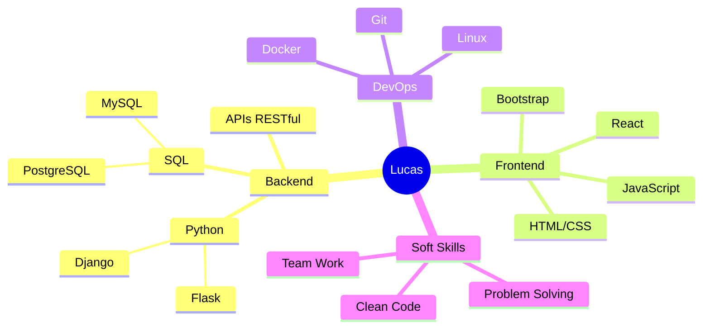

<div align="center">
  
# 👋 Olá, eu sou Lucas Casa Mausa

### 🐍 Desenvolvedor Backend Python | ⚛️ Estudando React

[](https://www.linkedin.com/in/lucas-casa-mausa/)
[](mailto:lucascasamausa000@gmail.com)
[](https://www.instagram.com/l.u.c.a.s_.s_/)
[](https://discord.com/channels/@luscovisqui/)


</div>

---

## 🚀 Sobre Mim

```python
class DevLucas:
    def __init__(self):
        self.nome = "Lucas Casa Mausa"
        self.role = "Backend Developer"
        self.linguagens = ["Python", "JavaScript", "C++", "React"]
        self.interesses = ["IA", "Machine Learning", "Fullstack Development"]
        self.meta_atual = "Tornar-me um desenvolvedor Fullstack"
    
    def diga_ola(self):
        print("Obrigado por visitar meu perfil! Vamos construir algo incrível juntos!")

eu = DevLucas()
eu.diga_ola()
```

💡 **O que me move:** Transformar problemas complexos em soluções elegantes através do código.

🎯 **Objetivos atuais:** 
- Aprofundar conhecimentos em **IA e Machine Learning**
- Dominar **React** e desenvolvimento **Fullstack**
- Aplicar conhecimentos em projetos que façam a diferença

---

## 🛠️ Stack Tecnológica

<div align="center">

### 💻 Linguagens


### 🚀 Frameworks & Bibliotecas


### 🗄️ Banco de Dados


### 🎨 Frontend


### 🔧 Ferramentas & Ambiente


</div>

---

## 📊 Estatísticas GitHub

<div align="center">


<table>
  <tr>
    <td>
      
    </td>
    <td>
      
    </td>
  </tr>
</table>


</div>

---

## 🌱 Atualmente Aprendendo

<table align="center">
  <tr>
    <td align="center" width="50%">
      <h3>🤖 Inteligência Artificial</h3>
      • Machine Learning<br>
      • Deep Learning<br>
      • Análise de Dados
    </td>
    <td align="center" width="50%">
      <h3>⚛️ Desenvolvimento Frontend</h3>
      • React & Hooks<br>
      • Desenvolvimento de APIs<br>
      • UI/UX Design
    </td>
  </tr>
  <tr>
    <td align="center" width="50%">
      <h3>☁️ Cloud & DevOps</h3>
      • AWS/Azure<br>
      • Docker & Containerização<br>
      • CI/CD
    </td>
    <td align="center" width="50%">
      <h3>🎯 Soft Skills</h3>
      • Arquitetura de Software<br>
      • Clean Code<br>
      • Design Patterns
    </td>
  </tr>
</table>

---

## 💼 Experiência & Competências

<div align="center">



</div>

**🔹 Backend Development**
- Desenvolvimento de sistemas web com Python (Flask/Django)
- Design e implementação de APIs RESTful
- Modelagem e otimização de bancos de dados SQL

**🔹 Integração & Sistemas**
- Integração de sistemas e serviços
- Processamento e análise de dados
- Automação de processos

---

## 🎯 Projetos em Destaque

> 💡 *Confira meus repositórios fixados abaixo para ver alguns dos meus melhores trabalhos!*

---

## 📫 Vamos Conectar?

<div align="center">

### 🤝 Estou sempre aberto a novos projetos e colaborações!

[](https://www.linkedin.com/in/lucas-casa-mausa-exe)
[](mailto:lucascasamausa000@gmail.com)
[](https://www.instagram.com/l.u.c.a.s_.s_/)
[](https://discord.com/channels/@luscovisqui/)

</div>

---

<div align="center">
  
### ⚡ *"O código é poesia em movimento"*

**Obrigado pela visita! ⭐ Não esqueça de deixar uma estrela nos projetos que você gostar!**

</div>
